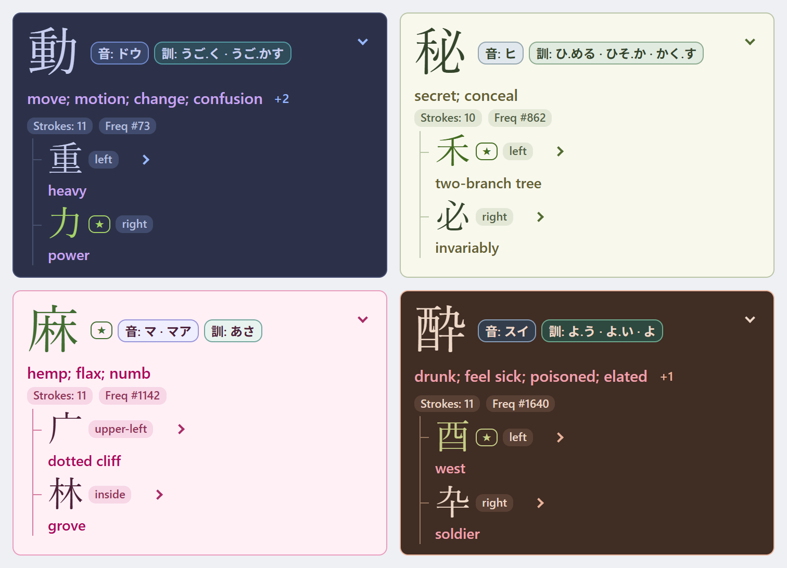
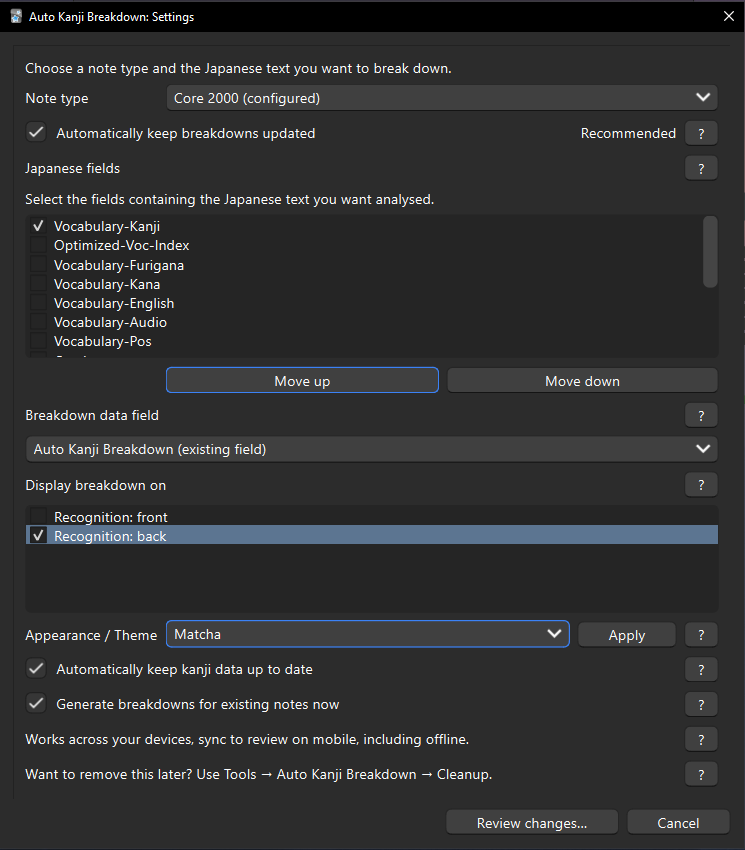
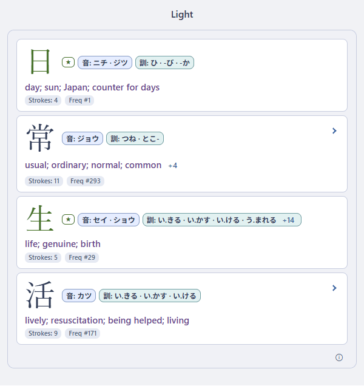

**Add kanji breakdown information to your Anki cards without the fuss. No need for external tools or overly complicated setups.**

Auto Kanji Breakdown adds readings, meanings, radicals, components, stroke counts and available frequency information to your existing Japanese cards. Just choose your cards kanji or vocab field once to setup, then explore the kanji as you review without leaving the app. No HTML or CSS editing required.

Free and open source. Offline-friendly, with synced mobile review and support for
Yomitan/AnkiConnect workflows.

**Beta: v0.9.0-beta.1**

[⬇️ Download beta](https://github.com/NikhilDhanda/Auto-Kanji-Breakdown/releases) · [📖 Setup](docs/setup.md) · [❓ FAQ](docs/faq.md)

    

*Real rendered examples of expanded kanji breakdowns visualized in different themes.*

  
  

*Example of fully expanded tree of a kanji down to the individual component*

## Features

- Read onyomi, kunyomi and English meanings without leaving the card.
- Explore expandable component trees, radical highlights and component positions.
- See stroke counts and frequency ranks when the source data provides them.
- Use your own note types, field names and existing decks.
- Keep breakdowns updated in desktop Anki, or refresh one note, selected notes or all configured notes.
- Choose from eight themes and review synced breakdowns offline.
- Keep source data current with optional background updates, and remove the integration safely later.

## Quick start ✨

1. [Install the add-on](docs/installation.md) and restart desktop Anki.
2. Open **Tools > Auto Kanji Breakdown > Settings**.
3. Choose the note type used by your Japanese cards.
4. Select the fields containing the Japanese text you want to explore.
5. Keep the recommended dedicated breakdown field, automatic updates and existing-note generation.
6. Choose where to show the breakdown. **Back** is recommended so you can answer first.
7. Choose **Review changes...**, check the summary, then **Apply**. Sync normally to bring the breakdowns to your other devices.

*Choose your note type, select the fields containing Japanese, then review and
apply your settings. The Apply button beside the theme changes appearance only.*

Repeat for other note types. [Full setup guide](docs/setup.md)

## Why I built this

After a couple of years of learning Japanese with Anki, I still struggled to tell
similar-looking kanji apart. I built Auto Kanji Breakdown to help me slow down,
notice their components and make sense of the differences.

I used earlier versions myself for about a year. After passing JLPT N2, I wanted
to give something back to the community and share a tool that might help learners
facing the same problem. My aim is to keep it free and convenient, without lots of
settings to fiddle with or paid external tools to rely on. It is not perfect, but
I hope it makes your study a little easier.

## About Me

Hi, I’m **[Nik Dhanda](https://github.com/NikhilDhanda)**, a Japanese learner and
computer science student from New Zealand. I created Auto Kanji Breakdown as a practical study tool
for my own needs at first, but since it's been so helpful in my studies, I decided to share it with other learners who could also benefit from it.

## Explore a breakdown

On a card containing 磨, expand its breakdown to explore components such as 麻 and 石,
then open deeper branches if you want more detail. Readings and meanings stay close
to the character. Longer lists offer a small **+N** control to reveal the rest.

The structure comes from KanjiVG, so some branches may look unfamiliar or more
detailed than a textbook explanation. [Using breakdowns](docs/usage.md)

## A note on accuracy

Auto Kanji Breakdown is intended as a **study aid for recognizing and distinguishing kanji**, not as an authoritative source on kanji etymology or Japanese word meanings.

Readings and meaning glosses come primarily from KANJIDIC2, while structural breakdowns are derived from KanjiVG. Auto Kanji Breakdown combines these datasets to present the information in a useful learner-focused form.

A component's displayed English meaning does not necessarily explain why the complete kanji has its modern meaning, and a visual decomposition may not reflect the character's historical formation or the way a native Japanese speaker would consciously interpret it. Some components are useful mainly for shape recognition or pronunciation rather than meaning.

Treat the breakdowns as memory and recognition cues, rather than absolute definitions. For precise word meanings, usage, or etymology, check a Japanese dictionary or a dedicated etymological reference.

## Themes

Choose from eight built-in themes to match your study style.

*All eight built-in themes, shown with 日常生活.*

**Light · Dark · Blue · Brown · Matcha · Matcha Dark · Sakura · Sakura Dark**

Choose a theme in Settings and press the adjacent **Apply** button. It updates all
configured breakdown displays without regenerating your notes. [Themes](docs/themes.md)

## Mobile and offline review 📱

Sync normally to bring existing breakdowns to mobile. They are designed for
AnkiMobile and AnkiDroid and can be reviewed offline after syncing. Mobile does not
run the desktop generator: after editing Japanese text on mobile, sync to desktop,
regenerate, then sync again. [Mobile guide](docs/mobile.md)

## Yomitan and AnkiConnect

Mining Japanese cards? When Yomitan creates a note through AnkiConnect using a
configured note type, Auto Kanji Breakdown can generate its breakdown on desktop.
Select the Japanese fields your workflow fills and keep automatic updates enabled.
[Workflow and prerequisites](docs/yomitan.md)

## Guides

| Getting started | Everyday use | Help |
| --- | --- | --- |
| [Installation](docs/installation.md) | [Using breakdowns](docs/usage.md) | [Troubleshooting](docs/troubleshooting.md) |
| [Setup](docs/setup.md) | [Mobile](docs/mobile.md) | [FAQ](docs/faq.md) |
| [Yomitan](docs/yomitan.md) | [Themes](docs/themes.md) | [Cleanup](docs/cleanup.md) |
| [Data updates](docs/database-updates.md) | [Changelog](CHANGELOG.md) | [Contributing](CONTRIBUTING.md) |

Developers: [documentation index](docs/README.md) · [build and release process](docs/development/releasing.md)

## Compatibility

Auto Kanji Breakdown requires Python 3.9+ through desktop Anki's bundled environment.
It has been used with Anki 25.02 and tested against newer releases including 26.8.1.
macOS and Linux desktop testing is still limited.

Breakdowns generated on desktop sync with normal card data for mobile review.
The desktop add-on itself does not run on AnkiMobile or AnkiDroid. The experimental
Svelte editor can bypass automatic generation; use the standard editor or
regenerate. [Troubleshooting](docs/troubleshooting.md)

## Privacy and data updates

Auto Kanji Breakdown does not upload your notes or study data. No telemetry,
analytics or add-on account is required. Generation and existing breakdowns work
offline; normal Anki sync is separate.

With **Automatically keep kanji data up to date** enabled, desktop Anki can contact
the official KANJIDIC2 and KanjiVG sources about once a month. You can turn this off
in Settings. A successful update supplies newer data for future generation; it does
not automatically rewrite existing notes. [Data updates](docs/database-updates.md)

## Safe removal

**Tools > Auto Kanji Breakdown > Cleanup...** lets you remove the display, clear
breakdown data, or do both. Japanese source fields, notes, cards, scheduling and
review history are preserved. Deleting an add-on-created field is optional and
subject to safety checks. [Cleanup and uninstalling](docs/cleanup.md)

## Licence and credits

Original software is **AGPL-3.0-or-later**; see [LICENSE](LICENSE).
Dictionary data comes from **KANJIDIC2, James William Breen and EDRDG**, under
CC BY-SA 4.0 / EDRDG terms. Structure comes from **KanjiVG, Ulrich Apel and contributors**,
under CC BY-SA 3.0. The combined adapted database is CC BY-SA 4.0. The software
licence does not replace the data licences.

[Third-party notices](THIRD_PARTY_LICENSES.md) · [Data attribution](docs/ATTRIBUTION.md)

[Project on GitHub](https://github.com/NikhilDhanda/Auto-Kanji-Breakdown)

## Contributing

Bug reports, clear reproduction examples and data corrections are welcome.
Please use synthetic examples and remove private information from screenshots.
See [CONTRIBUTING.md](CONTRIBUTING.md) before proposing code or data changes.
Bug reports, feature requests and data corrections are welcome through GitHub Issues.
