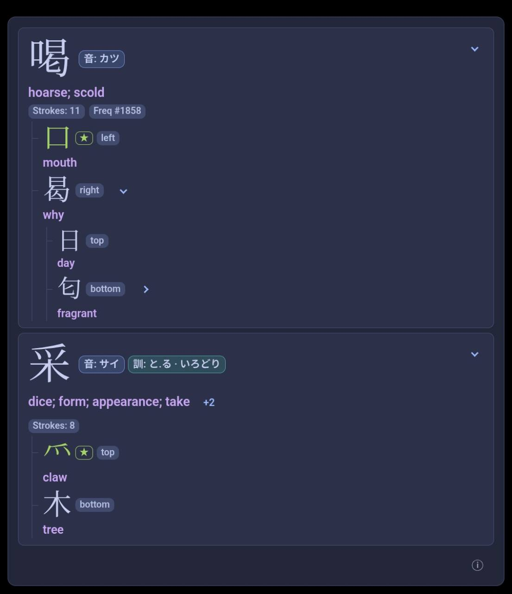

# Review on mobile

Prepare your breakdowns in desktop Anki, then sync desktop and your mobile app
normally. The information and display travel with your notes and cards. Existing
breakdowns can be reviewed offline after the sync finishes; desktop Anki does not
need to remain open for review.

The display is designed for AnkiMobile and AnkiDroid. Neither client runs this
desktop Python add-on or generates fresh breakdowns itself.

## If you edit Japanese text on mobile

1. Sync the mobile changes back to desktop Anki.
2. On desktop, regenerate that note or the affected selection.
3. Sync desktop, then sync mobile again.

If you change themes or the display sides on desktop, sync again to see the change
on mobile. See [using breakdowns](usage.md) for the regeneration commands.
